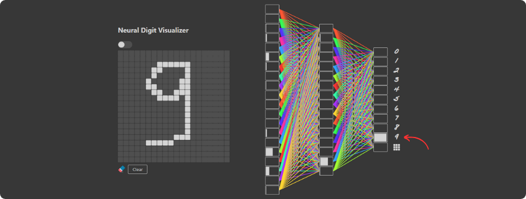

[](https://elmadichoaib.vercel.app) 

# Neural Digit Visualizer

**Neural Digit Visualizer** is a web-based application that allows users to draw handwritten digits on a grid and visualize how a neural network processes and classifies the input. This project provides an interactive way to understand the inner workings of a neural network, complete with visualizations of neuron activations at every layer.

<div align="center">



</div>

## Features

- **Interactive Grid**: Draw digits on a 20x20 pixel grid directly in the browser.
- **Neural Network Visualizations**: See neuron activations for each layer as the input propagates through the network.
- **Dynamic Prediction**: Get real-time predictions for the digit drawn.
- **Custom Dataset Training**: Users can create their datasets and train their own models.

## How This Is Built

1. Data Collection via Webpage:

   - Created a webpage with a grid where users could draw digits and enter their corresponding labels.
   - Used this functionality to save the drawn digits and their labels as training examples.
   - Repeated this process multiple times to collect sufficient training data for all digits.

     > Check these files: [index.html](./App/index.html), [script.js](./App/script.js)

2. Model Development in Jupyter Notebook:

   - Built a Jupyter Notebook to define the neural network structure.
   - Trained the model using the collected data and evaluated its accuracy to ensure proper functionality.

     > Check this file: [neural-digit-visualizer.ipynb](./NN%20Model/neural-digit-visualizer.ipynb)

3. Model Replication with NumPy:

   - Saved the trained model's weights into separate `.txt` files.
   - Reproduced the model's calculations using NumPy to predict new labels.

     > Check this file: [model_computations.py](./NN%20Model/model_computations.py)

4. Flask Server for Activation Computation:

   - Developed a Flask server to process input images.
   - The server computes all neuron activations in the neural network and sends the results back to the client.

     > Check these files: [app.py](./App/app.py), [utils.py](./App/utils.py)

5. Visualizing Neural Network Activations:

   - Enhanced the initial webpage by adding layers and neurons to visualize activations.
   - Used the computed activations from the Flask server to dynamically display how the network processes the input.

     > Check these files: [index.html](./App/index.html), [script.js](./App/script.js)

## How to Run

### Prerequisites

- [Python 3.x](https://www.python.org/)
- [Node.js](https://www.nodejs.org/)

### Installation

1. Clone the repository:

```bash
git clone https://github.com/Choaib-ELMADI/neural-digit-visualizer.git
```

```bash
cd neural-digit-visualizer
```

2. Set up the Python environment:

```bash
python -m venv TFVenv
```

```bash
source TFVenv/bin/activate   # On Windows: TFVenv\Scripts\activate
```

```bash
pip install -r requirements.txt
```

3. Start the Flask server:

```bash
python App/app.py
```

4. Open the `App/index.html` file in your browser.

## Dataset

- **Input Features**: Each training example is a 20x20 grayscale image, unrolled into a 400-dimensional vector.
- **Labels**:
  - `y = 0-9` for handwritten digits.
  - `y = 10` for an empty grid.

## Future Enhancements

- Add support for uploading custom datasets.
- Enhance visualizations to include metrics like loss and accuracy during training.
- Add options for training and deploying new models within the app.

## Contributing

Contributions are welcome! Fork the repository, make your changes, and submit a pull request.
